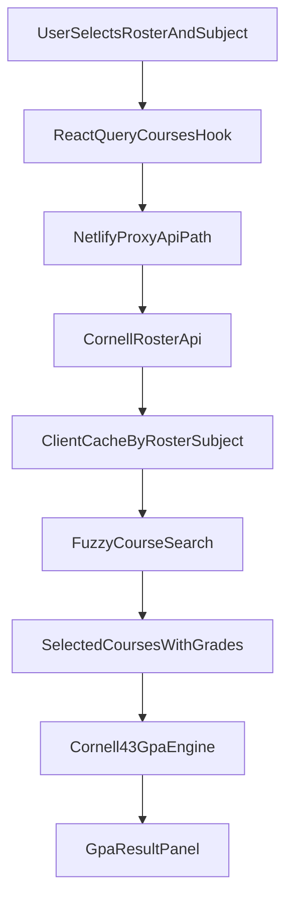

# GPA Calculator Foundation Plan

## Confirmed Product/Tech Decisions
- Scope now: GPA calculator only (course explorer deferred).
- Routing: `wouter`, client-side only.
- Data fetching/caching: React Query with client cache to reduce API load.
- API usage pattern: user selects `roster` (default `SP26`) and `subject` (e.g. `CS`), app requests classes from Cornell Roster endpoint and caches by `roster+subject` key.
- GPA policy: Cornell university standard `4.3` scale; `S/U` excluded from GPA.
- URL/query state: no URL persistence required initially.
- Styling/UI: Tailwind + shadcn only; shadcn component source stays in dedicated UI directory and is never edited directly for customization.
- shadcn preset requirement: initialize/apply using `--preset bd1jr62c`.
- Package/runtime toolchain requirement: use Bun only (`bun` and `bunx`) for dependency installs, script execution, and CLI commands.
- Deployment: Netlify with rewrite/proxy for CORS.

## Phase 1: Base UI Tooling Setup (Tailwind + shadcn)
- Configure Vite for alias + Tailwind plugin in [vite.config.ts](vite.config.ts).
- Add TS path aliases in [tsconfig.json](tsconfig.json) and [tsconfig.app.json](tsconfig.app.json) (`@/* -> ./src/*`).
- Replace global styles in [src/index.css](src/index.css) with Tailwind v4 import and shadcn token-compatible setup.
- Initialize shadcn in existing Vite app and create `components.json` with explicit directories:
- Use Bun-based preset init command for this repo setup: `bunx --bun shadcn@latest init --preset bd1jr62c`.
  - UI primitives in `src/components/ui/*`.
  - Shared app code in `src/components/*`, `src/lib/*`, `src/hooks/*`.
- Add initial shadcn primitives needed for v1 GPA flow (`button`, `input`, `label`, `select`, `card`, `command` or `combobox`-style composition, `table`, `badge`, `separator`, `skeleton`, `alert`).

References:
- [shadcn Vite installation docs](https://ui.shadcn.com/docs/installation/vite.md)

## Phase 2: App Architecture Skeleton (GPA-first)
- Replace starter content in [src/App.tsx](src/App.tsx) with route shell and page layout.
- Add route structure using wouter:
  - `/` -> GPA calculator page.
  - `*` -> simple not-found fallback.
- Wrap app with `QueryClientProvider` in [src/main.tsx](src/main.tsx), with conservative stale/cache defaults and retry policy.
- Create initial folders:
  - `src/pages/gpa/`
  - `src/features/gpa/`
  - `src/features/courses/`
  - `src/lib/api/`
  - `src/lib/gpa/`
  - `src/types/`

## Phase 3: Cornell Roster Integration + Netlify Proxy
- Add typed API client for `search/classes.json` requests in [src/lib/api](src/lib/api) keyed by `roster` + `subject`.
- Add React Query hooks in `src/features/courses` for:
  - fetching classes by roster/subject,
  - deduping requests,
  - caching and stale-time policy for repeated lookups.
- Add roster selector (default `SP26`) and subject selector to drive course fetch flow before fuzzy course selection UI.
- Add Netlify rewrite/proxy config in [netlify.toml](netlify.toml) so client calls `/api/*` and Netlify proxies to Cornell API origin.
- Verify the proxy path strategy avoids direct browser CORS issues.

References:
- [Netlify rewrites/proxies docs](https://docs.netlify.com/manage/routing/redirects/rewrites-proxies/)

## Phase 4: GPA Calculator Core UX (v1)
- Build GPA input model for selected courses:
  - selected course identity,
  - credit hours (from API when available),
  - selected grade (`A+ ... F`, plus `S`/`U`).
- Implement fuzzy course picking after subject fetch (client-side fuzzy match over fetched classes list).
- Implement GPA engine in `src/lib/gpa`:
  - Cornell 4.3 mapping,
  - weighted GPA = `sum(credits * points) / sum(graded credits)`,
  - exclude `S/U` from GPA denominator and numerator.
- Show clear GPA result panel + per-course contribution summary.
- Ensure mobile-first responsive layout with shadcn components and Tailwind utility composition.

## Phase 5: Cursor Governance (Rules + Skill + Hooks)
- Create focused `.mdc` rules in [.cursor/rules](.cursor/rules):
  - `frontend-architecture.mdc` (feature folder boundaries, route/page conventions, no giant components).
  - `react-typescript-quality.mdc` (strict typing, query key discipline, safe state modeling, accessibility basics).
  - `shadcn-tailwind-guardrails.mdc` (compose shadcn; no direct edits to `src/components/ui/*`; customization via wrappers/theme/tokens).
  - `netlify-proxy-and-api.mdc` (all Cornell API calls go through `/api/*`; no direct cross-origin calls).
- Create project skill in [.cursor/skills/gpa-frontend-workflow/SKILL.md](.cursor/skills/gpa-frontend-workflow/SKILL.md) for repeatable workflows:
  - adding GPA features,
  - adding course API hooks,
  - enforcing shadcn composition and proxy patterns,
  - required pre-PR checklist.
- Add optional hooks config in [.cursor/hooks.json](.cursor/hooks.json) to run lightweight checks on write/command events (e.g., lint/typecheck reminders, prevent direct edits in `src/components/ui/*`).

## Phase 6: Quality Gates + Deployment Readiness
- Add baseline docs in [README.md](README.md): local run, env assumptions, proxy behavior, and GPA policy notes.
- Verify lint/typecheck/build pass.
- Validate responsive behavior at common mobile widths.
- Smoke test deployed Netlify app for proxy + GPA flow.

## Suggested Implementation Order
1. Tailwind + shadcn base setup.
2. Routing + QueryClient shell.
3. Netlify proxy + typed API client.
4. Roster/subject selection and course fetch cache.
5. Fuzzy course picker + grade entry + GPA computation.
6. Cursor rules/skill/hooks.
7. Final polish, docs, and deployment verification.

## Mermaid: Data Flow (v1)

